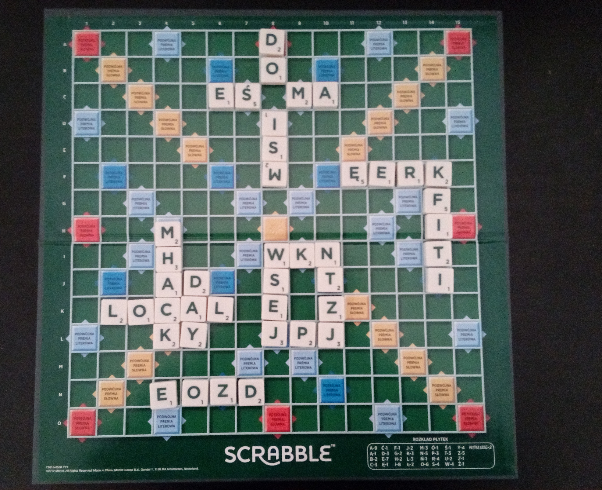
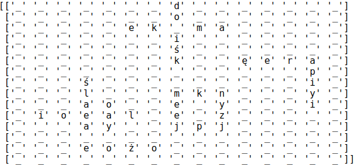

# Scrabble-Detector
Automatic point counting system for Scrabble game 
Application detects game board and tiles with letter, using OpenCV image processing library, then classifies each tile with convolutional neural network built in Keras, and finally counts points for each player turn.

  Input file:
   
  

  Detected board:
   
  

